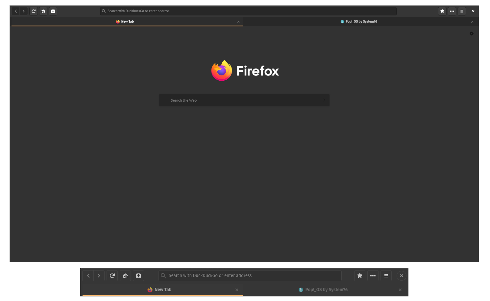

<h1 align="center">
	 
 Firefox Pop_OS! theme
</h1>

<strong>A Pop_OS! theme for Firefox</strong>

This theme follows lastest Pop_OS! style, *CURRENTLY ONLY DARK MODE*.

This is a fork of <a href="https://github.com/rafaelmardojai/firefox-gnome-theme">rafaelmardojai/firefox-gnome-theme</a> which I used and changed a few bits (Some icons and some colour tweaks). If you would like to, feel free to make changes and send them through as a pull request.
  

 In firefox enter about:config in the URL bar then search for "toolkit.legacyUserProfileCustomizations.stylesheets" and set to true, close all firefox instances. Then running this in the terminal should work: cd ~/Downloads/; git clone https://github.com/botrosco/firefox-pop_os-theme.git; cp -r firefox-pop_os-theme/chrome ~/.mozilla/firefox/*.default-release/ 

